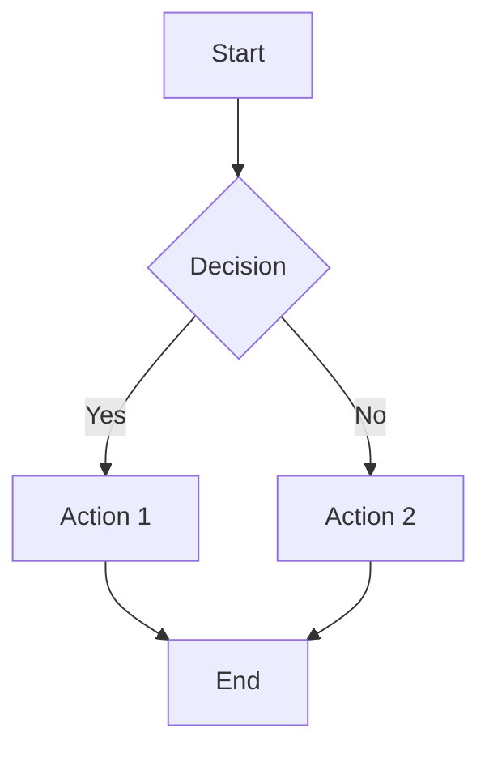

# Style Guide
{: .no_toc }

A visual reference for all styling elements available in this documentation site.
{: .fs-6 .fw-300 }

## Table of contents
{: .no_toc .text-delta }

1. TOC
{:toc}

---

## Typography

### Headings

# Heading 1
## Heading 2
### Heading 3
#### Heading 4
##### Heading 5
###### Heading 6

### Text Sizes

Largest text
{: .fs-9 }

Large text
{: .fs-7 }

Normal text (default)

Small text
{: .fs-3 }

Smallest text
{: .fs-1 }

### Font Weights

Light text (300)
{: .fw-300 }

Normal text (400) - default

Medium text (500)
{: .fw-500 }

Bold text (700)
{: .fw-700 }

## Colors

### Text Colors

Green text
{: .text-green-300 }

Blue text
{: .text-blue-300 }

Yellow text
{: .text-yellow-300 }

Red text
{: .text-red-300 }

Grey text
{: .text-grey-dk-100 }

## Buttons

[Default Button](#){: .btn }

[Primary Button](#){: .btn .btn-primary }

[Outline Button](#){: .btn .btn-outline }

[Purple Button](#){: .btn .btn-purple }

[Blue Button](#){: .btn .btn-blue }

[Green Button](#){: .btn .btn-green }

## Lists

### Unordered List

- First item
- Second item
  - Nested item
  - Another nested item
    - Deeply nested item
- Third item

### Ordered List

1. First step
2. Second step
   1. Sub-step A
   2. Sub-step B
3. Third step

### Task List

- [x] Completed task
- [x] Another completed task
- [ ] Pending task
- [ ] Another pending task

## Code

### Inline Code

Use `inline code` for commands, variables, or short snippets like `const greeting = "Hello"`.

### Code Blocks

```python
def fibonacci(n):
    """
    Calculate Fibonacci number at position n.
    
    Args:
        n (int): Position in Fibonacci sequence
        
    Returns:
        int: Fibonacci number at position n
    """
    if n <= 1:
        return n
    return fibonacci(n-1) + fibonacci(n-2)

# Usage
print(fibonacci(10))  # Output: 55
```

```javascript
// JavaScript example
const greet = (name) => {
  return `Hello, ${name}! Welcome to Notes By Noel.`;
};

console.log(greet('Developer'));
```

```bash
# Bash commands
cd /path/to/project
npm install
npm run dev
```

## Information Blocks

> **💡 Tip**: Use tips to highlight helpful information or best practices.

> **📝 Note**: Notes provide additional context or explanations.

> **⚠️ Warning**: Warnings alert readers to potential pitfalls or important considerations.

> **✨ Fun Fact**: Did you know? The warm green color scheme was specifically chosen to reduce eye strain during long reading sessions!

## Tables

### Basic Table

| Feature | Description | Status |
|:--------|:------------|:------:|
| Search | Full-text search | ✅ |
| Mobile | Responsive design | ✅ |
| Dark Mode | Dark color scheme | ⏳ |
| i18n | Internationalization | 📋 |

### Aligned Columns

| Left Aligned | Center Aligned | Right Aligned |
|:-------------|:--------------:|--------------:|
| Default | Use `:---:` | Use `---:` |
| Text | Text | Numbers |
| More text | More text | 123.45 |

## Labels

Default label
{: .label }

Blue label
{: .label .label-blue }

Green label
{: .label .label-green }

Purple label
{: .label .label-purple }

Yellow label
{: .label .label-yellow }

Red label
{: .label .label-red }

## Horizontal Rule

Use three dashes to create a horizontal rule:

---

Like that!

## Links

[External link](https://github.com)

[Internal link](getting-started)

[Link with title](https://github.com "Visit GitHub")

## Images

You can include images using Markdown syntax:

```markdown


*Image caption goes here*
```

## Callouts (Using Blockquotes)

### Information

> ℹ️ **Information**
>
> This is an informational callout. Use it for neutral, helpful information.

### Success

> ✅ **Success**
>
> This indicates a successful operation or positive outcome.

### Warning

> ⚠️ **Warning**
>
> This highlights something that requires caution or attention.

### Error

> ❌ **Error**
>
> This indicates an error or something to avoid.

### Tip

> 💡 **Pro Tip**
>
> Share insider knowledge or best practices here.

## Definition Lists

Term 1
: Definition for term 1

Term 2
: Definition for term 2
: Another definition for term 2

## Mermaid Diagrams (If Enabled)



## Math Equations (If Enabled)

Inline math: $E = mc^2$

Block math:

$$
\sum_{i=1}^{n} i = \frac{n(n+1)}{2}
$$

## Keyboard Keys

Press <kbd>Ctrl</kbd> + <kbd>C</kbd> to copy.

Use <kbd>⌘</kbd> + <kbd>V</kbd> to paste on Mac.

---

## Combining Elements

You can combine various elements for rich content:

### Example: Installation Guide

Follow these steps to set up your environment:

1. Install Python 3.8 or higher
   
   ```bash
   python --version
   ```
   
   > **📝 Note**: Make sure Python is added to your PATH.

2. Create a virtual environment
   
   ```bash
   python -m venv venv
   source venv/bin/activate  # On Windows: venv\Scripts\activate
   ```

3. Install dependencies
   
   ```bash
   pip install -r requirements.txt
   ```
   
   > **💡 Tip**: Use `pip list` to verify all packages installed correctly.

4. Run the application
   
   ```bash
   python main.py
   ```

Success!
{: .label .label-green }

---

This style guide demonstrates all the styling options available. Use these elements to create engaging, readable documentation! 🎨
